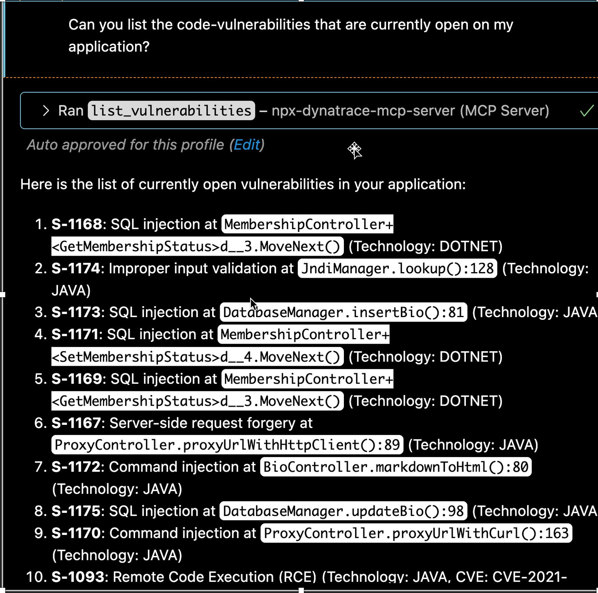
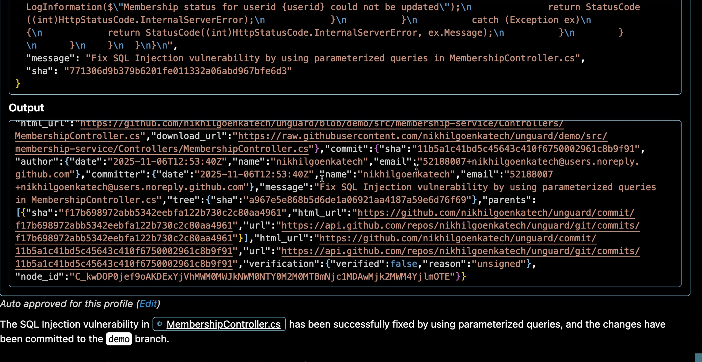
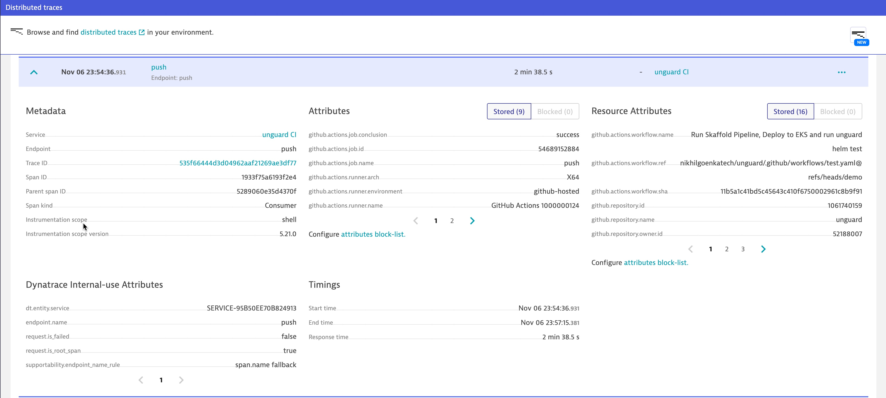
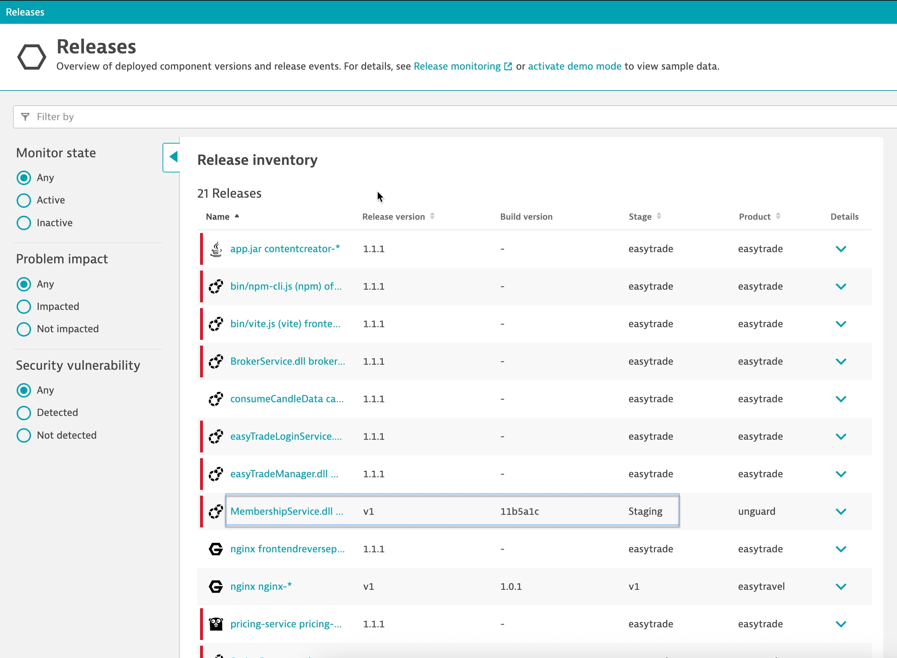
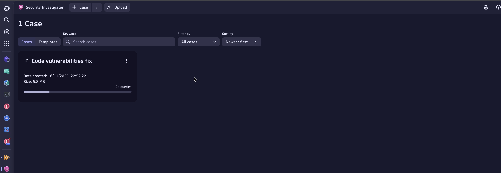

# Code Vulnerability Management Workflow with Dynatrace

## Technical Workflow for Dynatrace MCP Integration Towards Autonomous Remediation

### 1. 🛠️ List Code Vulnerabilities

The software developer initiates a prompt in Chat Copilot to list vulnerabilities in the "unguard" application. Chat Copilot interacts with the Dynatrace MCP Server to retrieve the list of detected vulnerabilities.

---

### 2. 🤖 Query Dynatrace Davis AI for Remediation Steps

The software developer prompts Dynatrace for remediation suggestions. The Davis causation AI engine, through Dynatrace MCP Server, responds with an actionable path tailored to each vulnerability.

---

### 3. ✍️ Apply Remediation Path

The engineer requests the GitHub Agent to apply the remediation path provided by Dynatrace, committing the necessary code patch.

---

### 4. ✅ Trigger Code Review

GitHub automatically opens a pull request for code review, depending on the complexity of the changes, and requests for a code review.

---

### 5. 🚀 Deploy Patch to Staging

Once approved, the code changes are pushed through the GitHub MCP Server. Further, GitHub Actions automatically deploy the patch to the staging environment.

---

### 6. 📊 Monitor CI Operations

Dynatrace orchestrates and monitors CI operations using OpenTelemetry (Otel) instrumentation within GitHub Actions.

---

### 7. 🆕 Track New Release

After deployment, Dynatrace identifies the new release under Releases with trace details like patch ID, user, and commit SHA.

---

### 8. 🛡️ Validate Release with SRG

Dynatrace’s Automation Engine uses SDLC events to trigger the **Site Reliability Guardian (SRG)**, which further validates the release. SRG ensures the new release meets quality and reliability standards before merging with the production branch.

#### Remediated Vulnerability

The **Site Reliability Guardian (SRG)** thoroughly validates the applied remediation path to ensure the release meets the highest quality standards. It confirms that no new vulnerabilities have been introduced by the code patch applied by **Open AI** and verifies that the **Service Level Objectives (SLOs)** are aligned with the desired business outcomes. This rigorous validation process provides confidence in the release quality, ensuring a reliable and secure deployment.

---

### 9. 📚 Feed Applied Remediation Path

Summarize and document the verified remediation path in the **Security Investigator app** to guide future vulnerability fixes.

